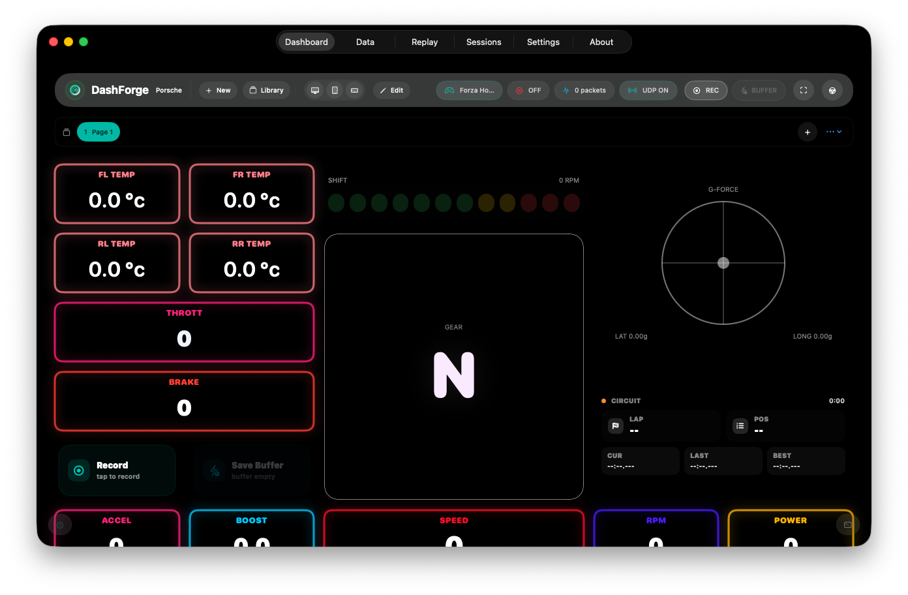

#  DashForge

> Build your telemetry cockpit.

<p align="center">
  
  
  
</p>

<p align="center">
  <sub>
    <a href="https://redbgsoftware.github.io/DashForge/">Website</a> •
    <a href="https://redbgsoftware.github.io/DashForge/docs/">Documentation</a> •
    <a href="https://redbgsoftware.github.io/DashForge/docs/user/downloads">Downloads</a> •
    <a href="https://redbgsoftware.github.io/DashForge/privacy.html">Privacy</a> •
    <a href="CHANGELOG.md">Changelog</a>
  </sub>
</p>

DashForge is a telemetry dashboard builder for racing games on macOS and iOS.
It turns live telemetry into customizable dashboards, recordings, replay,
session analysis, local sharing, hardware output, tactile feedback, cockpit fans,
Stream Deck actions, and AI-assisted local control.

<p align="center">
  
</p>

## What DashForge Does

- Build custom multi-page racing dashboards.
- Receive live telemetry from supported games.
- Record and replay `.dfrec` telemetry files.
- Group recordings into sessions and run driving analysis.
- Share dashboards, recordings, and sessions with nearby DashForge apps.
- Send selected telemetry fields to Arduino, ESP32, serial, and UDP devices.
- Drive Bass Shakers from telemetry or audio input.
- Drive cockpit fans with the Wind Simulator module.
- Trigger Windows game inputs through DashForge Bridge and Action Button widgets.
- Use Stream Deck keys for DashForge commands and live telemetry values.
- Expose trusted local commands and telemetry to AI tools through an MCP-compatible API.

## Dashboards And Widgets

DashForge includes a visual dashboard builder with:

- drag and drop widget editing
- multi-page dashboards
- swipe page navigation
- custom themes and per-page backgrounds
- local image assets and sticker widgets
- native and local-network web editing
- import/export for dashboards, recordings, sessions, templates, and assets

Premium widgets add advanced race HUDs, coaching, dynamics, tyre, trace, and
analysis views.

<p align="center">
  
</p>

See the widget reference:
https://redbgsoftware.github.io/DashForge/docs/user/widget-reference

## Supported Games

DashForge supports telemetry through native UDP parsers, DashForge Bridge, the
DashForge SCS plugin, and custom JSON profiles.

| Game | Support path |
|---|---|
| Forza Horizon 6 | Native UDP parser |
| F1 24 | Native UDP parser |
| F1 25 | Native UDP parser |
| Euro Truck Simulator 2 | DashForge SCS plugin |
| American Truck Simulator | DashForge SCS plugin |
| Assetto Corsa | DashForge Bridge |
| Assetto Corsa Competizione | DashForge Bridge |
| Custom UDP games/tools | JSON custom game profile |

Setup guide:
https://redbgsoftware.github.io/DashForge/docs/user/supported-games

## Companion Tools

Some integrations use companion downloads:

| Tool | File | Purpose |
|---|---|---|
| Stream Deck plugin | `DashForge-1.1.0.streamDeckPlugin` | Stream Deck actions for DashForge commands, telemetry keys, and Bridge inputs |
| DashForge Bridge Portable | `DashForgeBridgePortable-1.1.0-win-x64.exe` | Portable Windows Bridge for Assetto Corsa / ACC telemetry and game commands |
| DashForge Bridge Installer | `DashForgeBridgeSetup-1.1.0-win-x64.exe` | Windows installer with shortcuts and command-listener options |
| DashForge Lab | `DashForgeLab-1.1.0.dmg` | macOS simulator for telemetry, replay, parser, and hardware testing |
| DashForge SCS Plugin | `DashForgeSCSPlugin-1.1.0.zip` | ETS2 / ATS telemetry plugin for macOS and Windows |

Downloads page:
https://redbgsoftware.github.io/DashForge/docs/user/downloads

## Templates And Public Assets

This public repository includes community-facing resources:

- [Dashboard templates](templates/dashboards)
- [Game profiles](templates/game-profiles)
- [Sample replays](templates/sample-replays)

Dashboards can be imported directly into DashForge. Custom game profiles can be
used to add compatible UDP packet formats without changing the app.

## Public Repository Structure

```text
/
  index.html          Public landing page
  privacy.html        Privacy policy
  docs/               Generated Docusaurus documentation
  templates/          Public templates, sample replays, profiles, and assets
  images/             Website images only
```

`images/` belongs to the landing page. Documentation images live under
`docs/img/` in the generated documentation package.

## Documentation

Start here:

- [Getting Started](https://redbgsoftware.github.io/DashForge/docs/user/getting-started)
- [Complete User Tutorial](https://redbgsoftware.github.io/DashForge/docs/user/user-tutorial)
- [Supported Games](https://redbgsoftware.github.io/DashForge/docs/user/supported-games)
- [Dashboard Builder](https://redbgsoftware.github.io/DashForge/docs/user/dashboard-builder)
- [Widget Reference](https://redbgsoftware.github.io/DashForge/docs/user/widget-reference)
- [Downloads And Companion Tools](https://redbgsoftware.github.io/DashForge/docs/user/downloads)

## Privacy

DashForge processes telemetry locally on the user device. Local-network features
such as sharing, web builder, Bridge commands, hardware output, and MCP/API
control stay under user control.

Privacy policy:
https://redbgsoftware.github.io/DashForge/privacy.html

## License

This repository contains public documentation, templates, website assets, sample
resources, and companion-tool release references.

DashForge application source code is proprietary and is not included in this
repository.

<p align="center">
  <sub>© 2026 RedBG Software — DashForge</sub>
</p>
