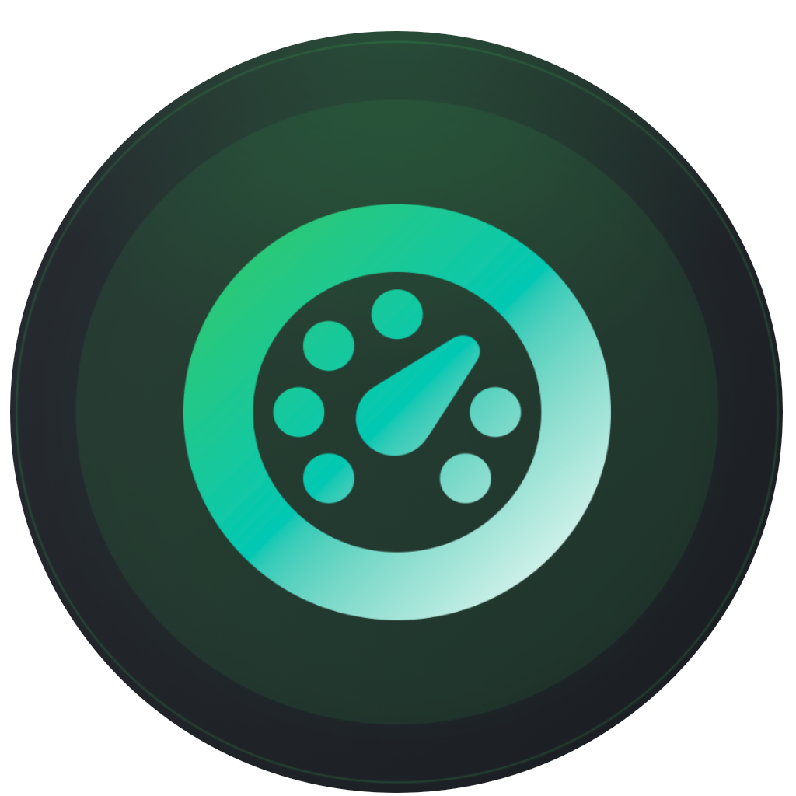
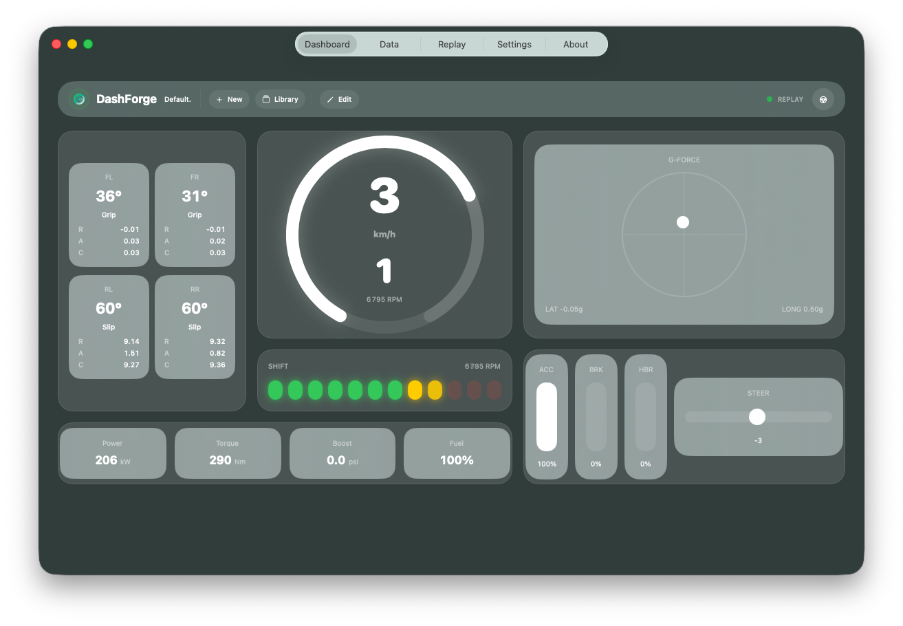
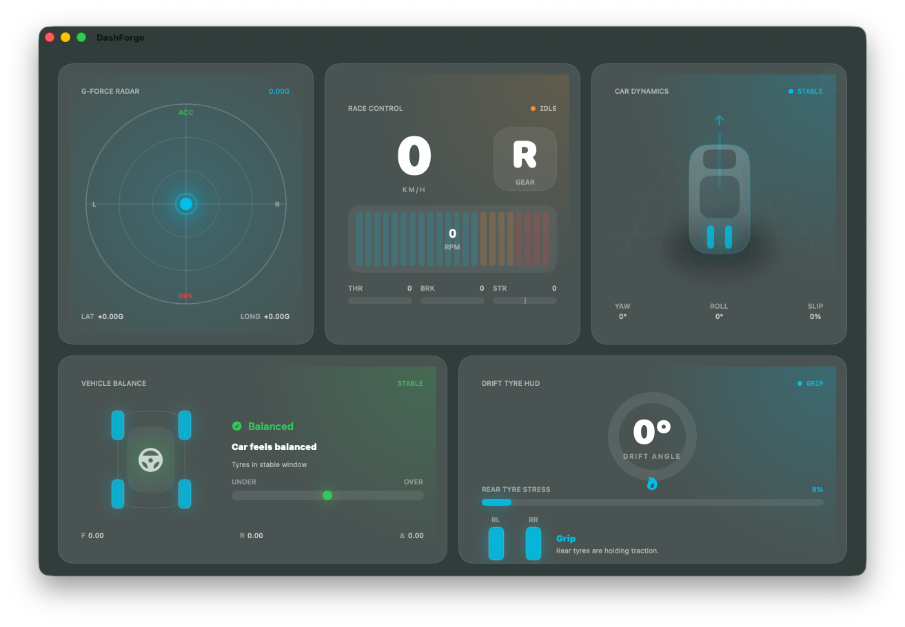

#  DashForge

> **Forge your telemetry cockpit.**

<p align="center">
  
  
  
</p>
<p align="center">
  <sub>
    <a href="https://redbgsoftware.github.io/DashForge/">Website</a> •
    <a href="https://redbgsoftware.github.io/DashForge/privacy.html">Privacy</a> •
    <a href="#">App Store</a>
  </sub>
</p>

DashForge is a modern telemetry dashboard builder for sim racing and racing games.  
Create immersive racing HUDs, visualize live telemetry, replay sessions, and build fully customizable cockpit layouts across macOS and iOS.

<br>

<p align="center">
  
</p>

<br>

---

<br>

# ✨ Features

### 🏎 Live UDP Telemetry

Receive real-time telemetry data from supported racing games.

- Speed
- RPM
- Gear
- Throttle / Brake
- Steering
- G-Force
- Drift Angle
- Vehicle Dynamics
- Tyre Stress


### 🎛 Dashboard Builder

Build your own telemetry cockpit visually.

- Drag & drop widgets
- Resize and position freely
- Custom themes and colors
- Glass / AMOLED / Neon styles
- Compact & Builder layouts
- Multi-device responsive UI


### ⏺ Record & Replay

Capture telemetry sessions and replay them later.

- Replay previous runs
- Analyze telemetry traces
- Review driving behavior
- Compare inputs and vehicle balance

<br>
<br>

# 👑 Premium Widgets Pack

Advanced telemetry widgets designed for immersive sim racing setups.

<p align="center">
  
</p>

### Included Widgets

- 🏁 Race Control
- 🌀 Car Dynamics
- ⚖ Vehicle Balance
- 🔥 Drift Tyre HUD
- 🌌 G-Force Radar
- 📊 Multi-Trace Telemetry

Future premium widgets are included with the purchase.

<br>

---

<br>


# 🧩 Dashboard Templates

Community dashboard templates are available here:

```text
/templates/dashboards
```

You can:

* import dashboards
* share layouts
* create themed cockpits
* build game-specific setups


<br>
<br>


# 🎮 Supported Games

Current telemetry support includes:

* Forza Horizon 6

Additional games can be added through custom telemetry profiles.

<br>
<br>

# 🛠 Custom Game Profiles

DashForge supports custom telemetry specifications using JSON profiles.

This allows the community to:

* add new games
* define telemetry offsets
* create custom mappings
* share integrations

```text
/templates/game-profiles
```


<br>
<br>

# 📚 Documentation

Documentation is available in:

```text
/docs
```

Recommended starting points:

* getting-started.md
* udp-setup.md
* import-export.md
* custom-game-profiles.md

<br>

---

<br>

# 🚀 App Store

DashForge will be available on the App Store soon.


<br>
<br>

# 🤝 Community

Community contributions are welcome.

You can contribute:

* dashboard templates
* telemetry profiles
* documentation improvements
* bug reports
* feature suggestions

<br>
<br>

# 🔒 Privacy

DashForge does not collect or transmit personal telemetry data.

Telemetry processing remains local on the user’s device.

See:

```text
/privacy.html
```

<br>

# 📬 Contact

contact@redbgsoftware.com

<br>

# ⚠ License

This repository contains:

* public documentation
* templates
* telemetry profiles
* community resources

DashForge application source code is proprietary and not included in this repository.

<br>

<p align="center">
  <sub>
    © 2026 RedBG Software — DashForge
  </sub>
</p>


