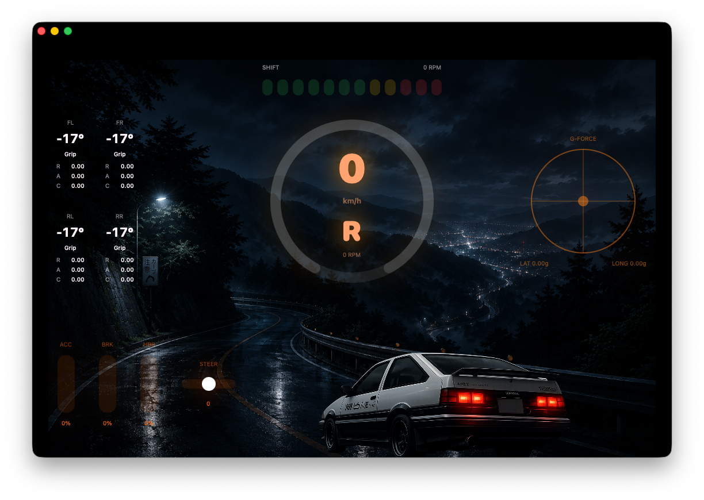

# Initial D Touge

Japanese-inspired mountain pass dashboard for DashForge.

Designed for night driving, rain sessions, and immersive telemetry.

  

## Features

- Large central tachometer
- Touge-inspired layout
- Night-drive atmosphere

## Installation

1. Download initial-D-touge.dfdash
2. Open DashForge
3. Import the dashboard
4. Start driving

## Author

RedBG Software
