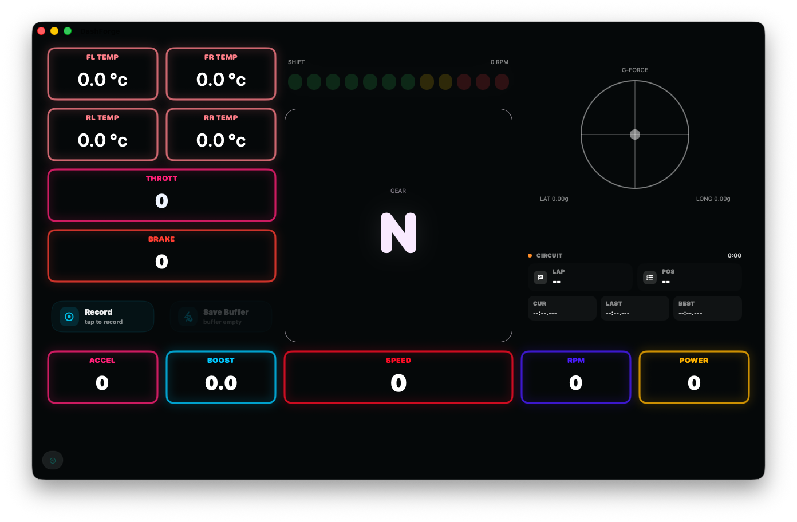

# Neon

Neon is a high-contrast racing dashboard for DashForge, designed to keep the
most important live telemetry readable at a glance.

Its dark cockpit layout uses color-coded neon accents to separate tires,
driving inputs, performance data, and session information without distracting
from the race.

  

## Dashboard Highlights

- Large central gear indicator
- Progressive shift-light display
- Front-left, front-right, rear-left, and rear-right tire temperatures
- Throttle and brake input monitoring
- Live G-force visualization
- Circuit, lap, position, and timing information
- Speed, engine RPM, boost, acceleration, and power telemetry
- Quick actions for recording and saving the live buffer
- Two included dashboard pages ready for further customization

## Layout

The dashboard is organized into three clear areas:

- **Left:** tire temperatures, throttle, brake, and recording controls
- **Center:** shift lights and a large gear display
- **Right:** G-force and circuit/session information

The lower telemetry bar provides acceleration, boost, speed, RPM, and power
values with individual neon colors.

## Installation

1. Download [`neon.dfdash`](neon.dfdash).
2. Open the Dashboard library in DashForge.
3. Choose **Import**.
4. Select `Neon.dfdash`.
5. Open the imported dashboard and start a supported telemetry source.

DashForge automatically restores the layout, widget sizes, styles, theme, and
telemetry bindings stored in the package.

## Package Contents

- `neon.dfdash` — importable DashForge dashboard
- `preview.png` — dashboard preview
- `package/manifest.json` — package metadata
- `package/dashboard.json` — dashboard source

## Author

RedBG Software
